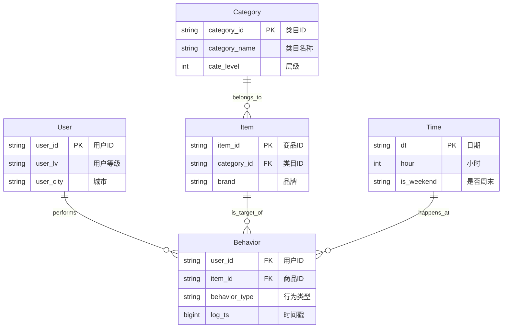

# 淘宝用户行为数据仓库 - 概念模型设计

## 1. 业务背景
本项目旨在构建一个基于Hive的数据仓库，用于分析淘宝用户的行为数据（浏览、加购、收藏、购买）。通过对海量日志数据的挖掘，分析用户活跃度、商品热度、转化率等核心指标，为业务决策提供支持。

## 2. 核心实体定义 (Entities)

根据业务需求，识别出以下核心实体：

### 2.1 用户 (User)
*   **定义**: 产生行为的主体，即淘宝的注册用户。
*   **核心属性**:
    *   用户ID (User ID): 唯一标识。
    *   用户等级 (Level): 用户的会员等级。
    *   注册日期 (Registration Date): 用户注册的时间。
    *   地域信息 (City/Province): 用户所在的地理位置。

### 2.2 商品 (Item)
*   **定义**: 用户行为的目标对象。
*   **核心属性**:
    *   商品ID (Item ID): 唯一标识。
    *   商品名称 (Name): 商品的标题。
    *   品牌 (Brand): 商品所属品牌。
    *   价格 (Price): 商品销售价格。

### 2.3 商品类目 (Category)
*   **定义**: 商品的分类归属，具有层级结构。
*   **核心属性**:
    *   类目ID (Category ID): 唯一标识。
    *   类目名称 (Name): 类目的中文名称。
    *   层级 (Level): 类目所属的层级（一级、二级等）。

### 2.4 时间 (Time)
*   **定义**: 行为发生的时间维度，用于时间序列分析。
*   **核心属性**:
    *   日期 (Date): 年-月-日。
    *   小时 (Hour): 0-23小时。
    *   特殊标记: 是否周末、是否节假日。

### 2.5 行为 (Behavior)
*   **定义**: 用户与商品之间的交互事件。
*   **核心属性**:
    *   行为类型 (Type): 浏览(pv)、加购(cart)、收藏(fav)、购买(buy)。
    *   发生时间 (Timestamp): 行为发生的具体时间点。

## 3. 实体关系 (Relationships)

*   **用户 - 行为**: 一对多 (1:N)。一个用户可以产生多条行为记录。
*   **商品 - 行为**: 一对多 (1:N)。一个商品可以被多次操作。
*   **商品 - 类目**: 多对一 (N:1)。一个商品属于一个类目（简化模型）。
*   **时间 - 行为**: 一对多 (1:N)。一个时间点（如某天某小时）发生多个行为。

## 4. 实体关系图 (ER Diagram)

