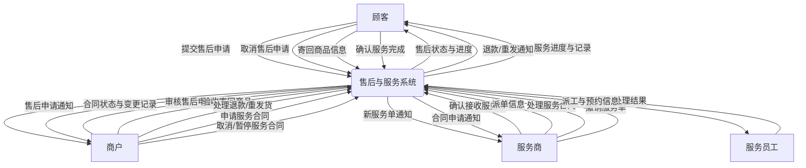
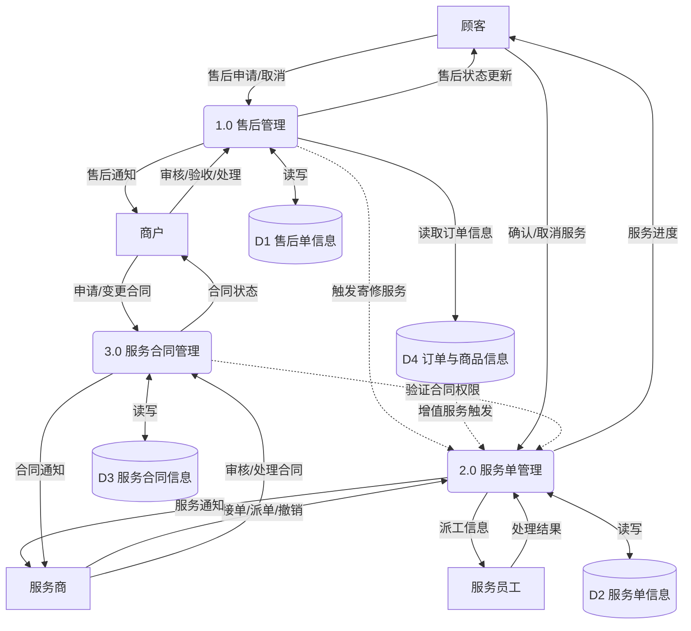
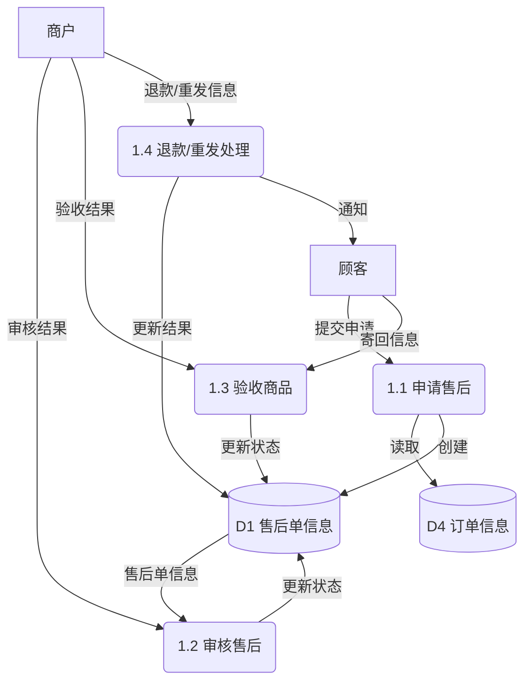
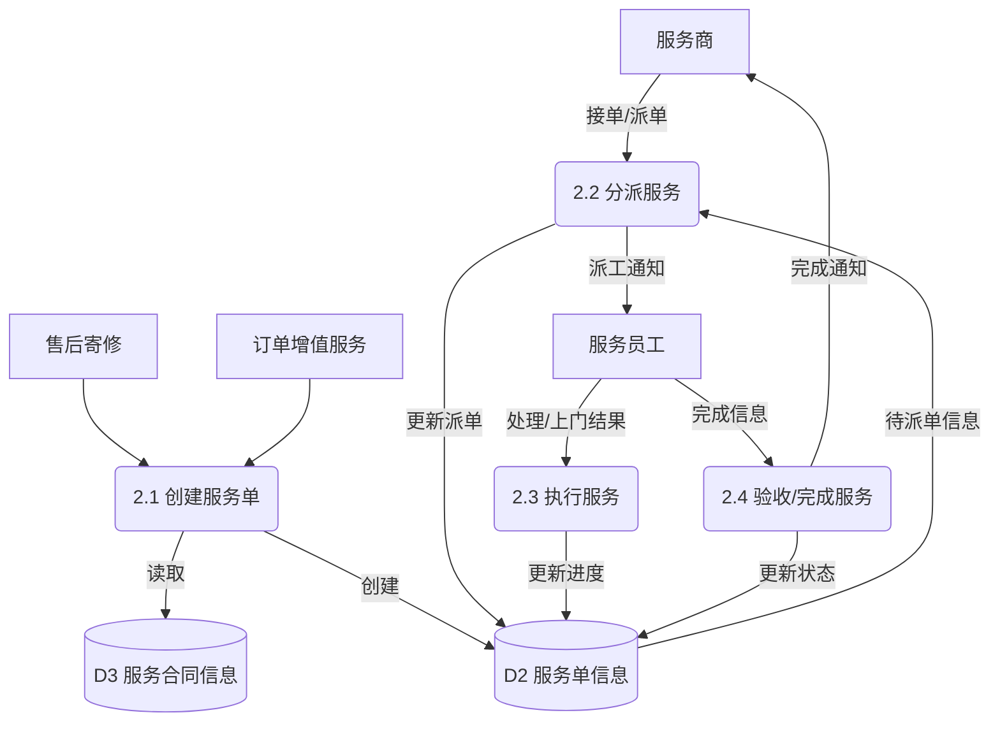
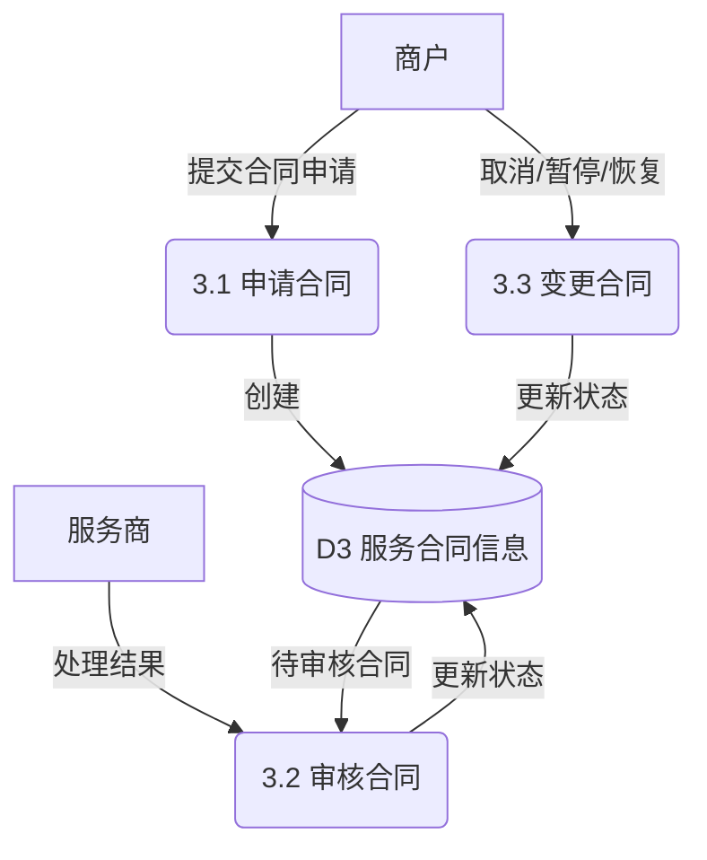

# 数据流图设计

根据《需求规格说明书》的内容，设计数据流图如下：

## 3.4.1 顶层图 (Context Diagram)

系统涉及的外部实体包括：顾客、商户、服务商、服务员工。

## 3.4.2 零层图 (Level 0 DFD)

系统主要功能模块划分为：售后管理、服务单管理、服务合同管理。

## 3.4.3 一层图 (Level 1 DFD)

### 1.0 售后管理分解

### 2.0 服务单管理分解

### 3.0 服务合同管理分解

